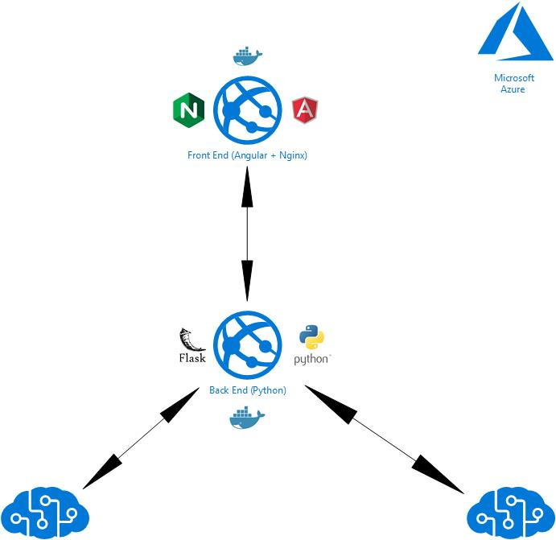

# Read -> Translate -> Say

Project created in order to use some Cognitive Services API's from Azure Cloud other deployment tools.

## Architecture

For the better explaining of the application, I'll describe each in divided sections below. Both the back and the front end
were deployed inside [Azure Web App for Containers](https://azure.microsoft.com/en-us/services/app-service/containers/) with [Docker](https://www.docker.com/).



### Front End

For the development of the front end, we used a famous web development framework called [Angular](https://angular.io/), which
makes it really straight forward to come with a whole app. For the CSS, we used [Bootstrap](https://getbootstrap.com), for making
styling faster.

### Back End

For the development of the server, that receives the call with the image and creates all the calls to Azure API's, we search a really
simple and powerful solution. The tool that best fits this need was [Flask](http://flask.pocoo.org/), a microframework that is really simple
to put things up and running and can get as huge and powerful as you want.

### Intelligent API's

In order to make this whole project works, I'm using two API's that are part of the Azure [Cognitive Services](https://azure.microsoft.com/en-us/services/cognitive-services/).
The first one is the [Vision API](https://azure.microsoft.com/pt-br/services/cognitive-services/computer-vision/#text). This is the one to use the OCR methods to extract the text
from the image. The other one, is [Translator API](https://docs.microsoft.com/en-us/azure/cognitive-services/translator/). This is used for translate the text Vision API extracted for us.

## Deployment

As mentioned before, the deployment was made using several services of [Microsoft Azure](https://azure.microsoft.com/en-us/). Besides, I'm using Docker Containers for making deploys smaller
and easier. The images I used are listed below:

- [Front End](https://hub.docker.com/r/guilhermeslucas/nginx-angular/) - Alpine image with the Angular app and  [Nginx](https://www.nginx.com/) for serving the application.
- [Back end](https://hub.docker.com/r/guilhermeslucas/rts-backend/) - Python base image with flask for the server and communication with API's.

## Running

There are several ways to run the app. I'll describe below the path to run native or with Docker. The two steps needs keys for the two API's mentioned before. You must insert the Vison API
[here](https://github.com/Guilhermeslucas/Azure-AI-API-Experiment/blob/master/back_end/reader.py#L8)
and abd the Translate API [here](https://github.com/Guilhermeslucas/Azure-AI-API-Experiment/blob/master/back_end/reader.py#L34).

### Native

To run the application in a native way, you have to start the Front and the Back End Applications. In order to make this easier, you can run the following commands inside the ```back_end``` folder:

**1. Running Back End:** In order to do this, install dependencies with pip, and then run the server, like this:

``` shell
pip3 install -r requirements.txt
python3 server.py
```

**2. Running Front End:** Just run the angular app, inside the ```front_end/rts_frontend``` folder after installing dependencies with npm and it should be fine:

``` shell
npm install
ng serve
```

The default path to check the application is **localhost:4200**.

### Docker

Running the application is really simple with Docker. There are just two docker commands you have to run:

``` shell
docker run -d -p 5000:5000 guilhermeslucas/rts-backend
docker run -f -p 4200:80 guilhermeslucas/nginx-angular
```

Feel free to fork and send me a pull request.